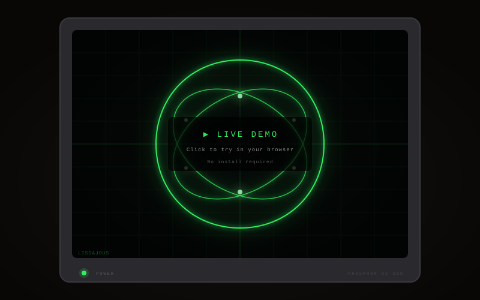

# Phosphor — Oscilloscope Simulator

[](LICENSE)
[](docker-compose.yml)
[](frontend/)
[](frontend/src/shaders/)

A web-based oscilloscope simulator with a physically-inspired multi-pass phosphor rendering pipeline. Simulates the characteristic glow, persistence, and bloom of vintage CRT oscilloscope displays.

<p align="center">
  <a href="https://hubertlim.github.io/oscilloscope_playground/">
    
  </a>
</p>

<p align="center">
  <a href="https://hubertlim.github.io/oscilloscope_playground/"><strong>🟢 Try the Live Demo</strong></a>
  &nbsp;&nbsp;·&nbsp;&nbsp;
  <a href="#quick-start">Docker Setup</a>
  &nbsp;&nbsp;·&nbsp;&nbsp;
  <a href="https://github.com/hubertlim/oscilloscope_playground/issues/new?template=bug_report.md">Report Bug</a>
  &nbsp;&nbsp;·&nbsp;&nbsp;
  <a href="https://github.com/hubertlim/oscilloscope_playground/issues/new?template=feature_request.md">Request Feature</a>
</p>

## Quick Start

```bash
docker compose up --build
```

Open **http://localhost:8090** in your browser. That's it.

> **Requirements:** Docker and Docker Compose. Nothing else is installed on your machine.

## Features

### Signal Modes

| Mode | Description |
|------|-------------|
| **Lissajous** | Classic XY figures with adjustable frequency, phase, and amplitude |
| **Waveform** | Sine, square, sawtooth, triangle, noise — Y-T sweep or X-Y dual-channel |
| **Multi** | Additive synthesis, AM/FM modulation, harmonic series |
| **Audio** | Real-time music visualizer — microphone or audio file input |
| **Draw** | Freehand vector drawing with templates and keyframe animation |

### Audio Visualizer

Four display modes for live audio: **Waveform** (time-domain), **Spectrum** (FFT with log scale), **X-Y** (stereo oscilloscope), **Radial** (circular spectrum with beat detection). Auto-gain scales weak signals to fill the screen. Drag-and-drop audio files or use your microphone.

### Vector Canvas

Draw directly on the scope screen. 10 built-in templates (circle, star, heart, spiral, etc.). Catmull-Rom spline smoothing. Keyframe animation with timeline scrubbing and loop playback. Save drawings as presets.

### Rendering Pipeline

```
Pass 1: BEAM        Soft gaussian dots, additive blending (HDR)
Pass 2: PHOSPHOR    Exponential decay persistence (linear HDR space)
Pass 3: BLOOM       Two-pass Gaussian blur at half resolution
Pass 4: COMPOSITE   Tone mapping, CRT curvature, vignette, scanlines, grid
```

The phosphor buffer runs in linear HDR space using HalfFloat textures. Tone mapping (Reinhard) is applied only once in the composite pass, preventing accumulation artifacts.

### UI

- **Playground mode** — sliders, toggles, and shape selectors for all parameters
- **Realistic mode** — skeuomorphic oscilloscope panel with rotary knobs, BNC connectors, and phosphor color switch
- **Collapsible panel** — press **Tab** to hide controls and maximize the scope
- **Fullscreen** — press **F** or double-click the scope screen
- **Floating quick-controls** — signal mode tabs, phosphor color, bloom, and persistence available when the panel is collapsed
- **Ambient desk surface** — subtle workbench texture behind the oscilloscope

### Keyboard Shortcuts

| Key | Action |
|-----|--------|
| `Tab` | Toggle controls panel |
| `F` | Toggle fullscreen |
| `Esc` | Exit fullscreen |

## Architecture

```
docker-compose.yml
├── nginx            Port 8090 → browser
│   ├── /            Static frontend (Vite build)
│   └── /api/*       Proxy to backend
├── backend          Node.js + Express + SQLite
│   └── /api/presets CRUD for saved configurations
└── frontend-build   Vite + TypeScript + Three.js → static files
```

### Tech Stack

| Layer | Technology |
|-------|-----------|
| Rendering | Three.js + custom GLSL shaders |
| Frontend | TypeScript, Vite |
| Backend | Node.js, Express, better-sqlite3 |
| Audio | Web Audio API (AnalyserNode, FFT) |
| Serving | Nginx (reverse proxy + static files) |
| Container | Docker Compose |

## Development

All development happens inside Docker. No local Node.js required.

```bash
# Start the app
docker compose up --build

# Rebuild after changes
docker compose down && docker compose up --build

# Reset database (re-seeds demo presets)
docker compose down -v && docker compose up --build
```

See [CONTRIBUTING.md](CONTRIBUTING.md) for project structure, rendering pipeline details, and contribution guidelines.

## License

[MIT](LICENSE)
